# OPC UA Client on STM32

Complete tutorial on deployment of OPC UA client on NUCLEO-F767ZI.

## Abstract

This is a detailed guide on installation of OPC UA client on Nucleo-F767ZI board. OPC UA based on open62541 library. open62541 is installed upon FREERTOS task and functioning LWIP. Guide also includes printf function implementation for debug purposes.
Guide should be followed in order it is written.
Guide is made solely for Nucleo-F767ZI board, however, guide includes sources that will allow to adjust to other STM32 boards.

## Index

- [OPC UA Client on STM32](#opc-ua-client-on-stm32)
  - [Abstract](#abstract)
  - [Index](#index)
  - [Preparation](#preparation)
  - [Project creation](#project-creation)
  - [Project set up](#project-set-up)
    - [Clock configuration](#clock-configuration)
    - [Ethernet configuration](#ethernet-configuration)
    - [FreeRTOS configuration](#freertos-configuration)
      - [FreeRTOS test](#freertos-test)
    - [LWIP configuration](#lwip-configuration)
      - [LWIP test](#lwip-test)
    - [Printf configuration (optional)](#printf-configuration-optional)
      - [Printf test](#printf-test)
  - [Open62541 library integration](#open62541-library-integration)
    - [Library download](#library-download)
    - [Library build](#library-build)
    - [Library adjustments](#library-adjustments)
  - [Client configuration](#client-configuration)


## Preparation

Hardware required:
1. NUCLEO-F767ZI;
2. Ethernet cable.
3. microUSB;

Software required:
1. [STM32 CubeIDE](https://www.st.com/en/development-tools/stm32cubeide.html);
2. [Visual Studio](https://visualstudio.microsoft.com/downloads/);
3. [Tera Term](https://teratermproject.github.io/index-en.html);
4. [UA Expert](https://www.unified-automation.com/products/development-tools/uaexpert.html)
5. [Cmake](https://cmake.org/download/).

This guide was written on the following software versions:
| Software       | Version |
| -------------- | ------- |
| Visual Studio  | 2022    |
| STM32 Cube IDE | 1.14.1  |
| open62541      | 1.3.9   |

Board documentation for the board is required for this guide. Documentation can be found [here](https://www.st.com/en/evaluation-tools/nucleo-f767zi.html#documentation).

## Project creation

1. Open STM32 CubeIDE and create a new workspace. Press *Launch*.

> For every new project separate workspace must be created, otherwise STM32 CubeIDE can mix files from different projects in the same workspace.

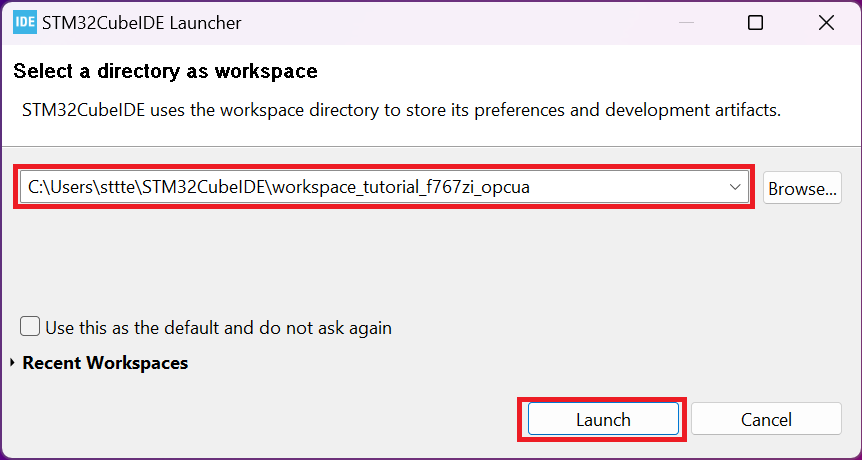

2. Open STM32 CubeIDE **File > New > STM32 Project**. In STM32 Project window go to **Board Selector**, select your board *NUCLEO-F767ZI* and click *Next*.

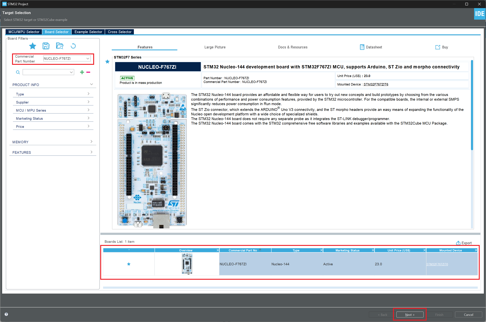

3. Chose project name and click *Finish*.

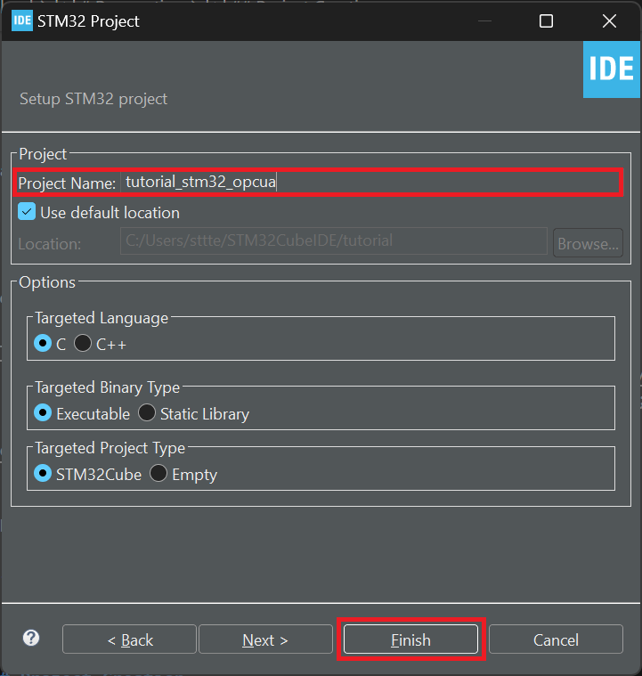

4.  In window **Initialize all peripherals with their default mode?** click *Yes*.

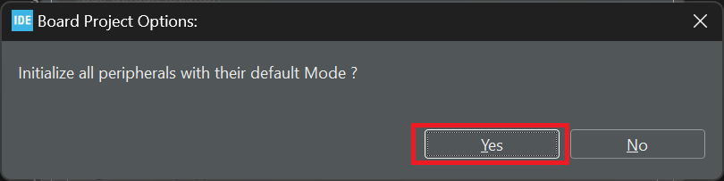

## Project set up

In order for OPC UA library to run several points should be fulfilled:
1. FreeRTOS must be set up;
2. LWIP must be on FreeRTOS task;

### Clock configuration

1. In <.ioc> file go to **System Core** > **RCC**. Set **High Speed Clock (HSE)** to *Crystal/Ceramic Resonator* and **Low Speed Clock (LSE)** to *Disable*.

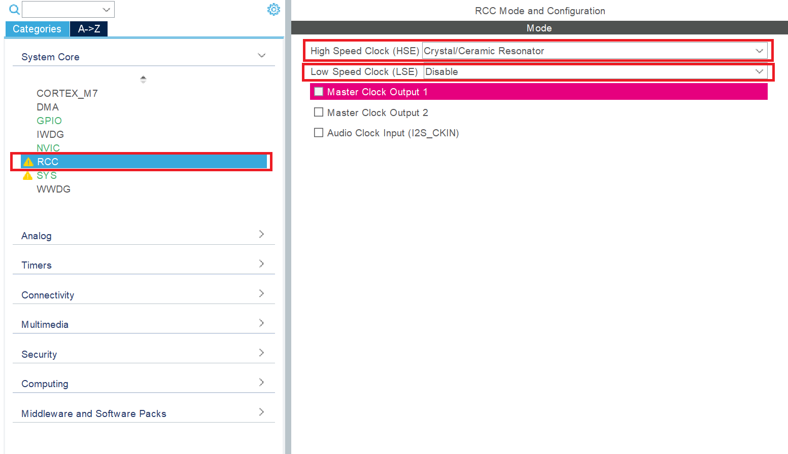

> This clock will be used by the board.

2. In <.ioc> file go to **System Core** > **SYS**. In **Debug** select *Serial Wire*, in **Timebase Source** select *TIM6*.

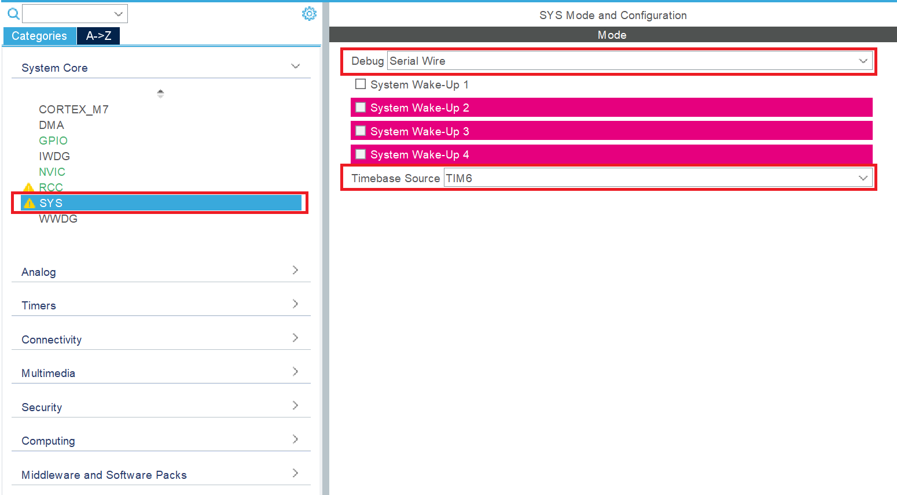

> This clock will be used by FreeRTOS.

3. In <.ioc> file go to **Clock Configuration**. In **HCLK(MHz)** set max frequency (216MHz) and click **Enter**.

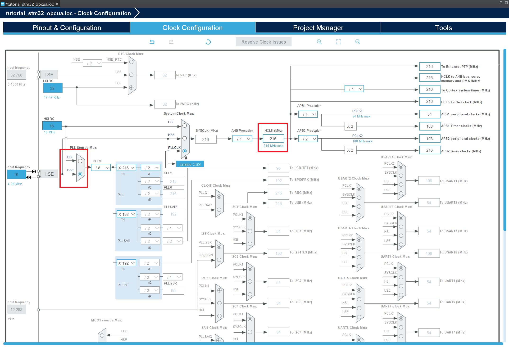

### Ethernet configuration

1. In **Project Explorer** open <.ioc> file. In **Connectivity** > **ETH**. In **Mode** select *RMII*. In **Parameter Settings** > **Rx Mode** select *Interrupt Mode*.

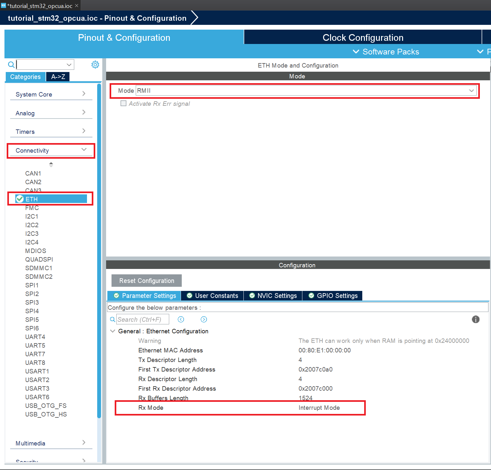

1. In **GPIO Setting** pins should be adjusted according to the board schematics. Default settings may be incorrect.

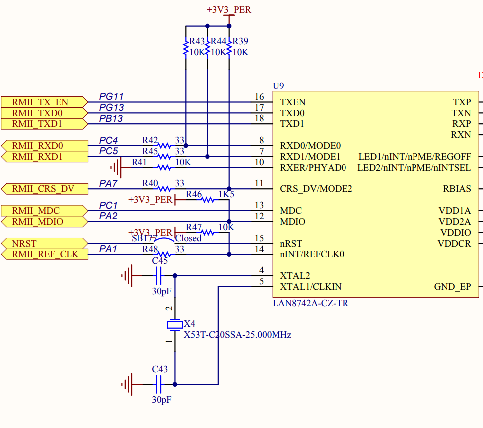

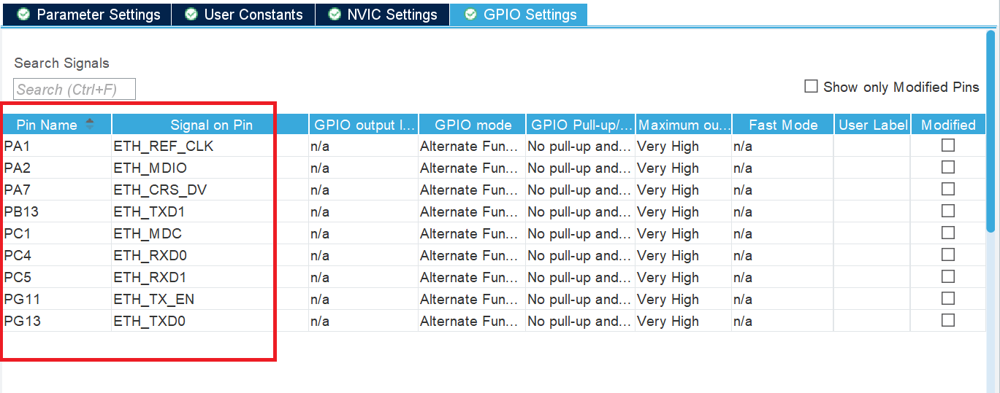

> Detailed set up of ethernet video guide can be found [here](https://www.youtube.com/watch?v=8r8w6mgSn1A&list=PLfIJKC1ud8ggZKVtytWAlOS63vifF5iJC).

### FreeRTOS configuration

1. In <.ioc> file go to **Middleware and Software Packs** > **FREERTOS**. Set **Interface** to *CMSIS_V1*.

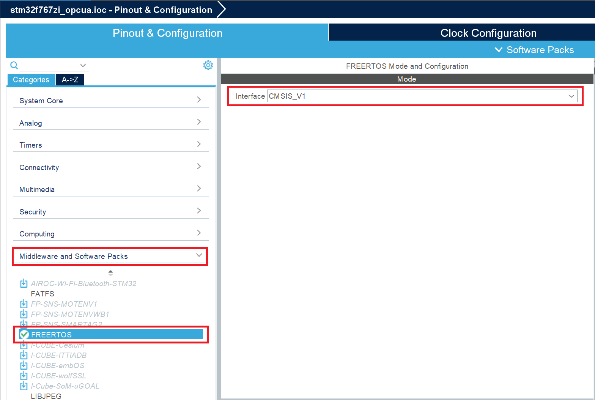

2. In **Advance settings > USE_NEWLIB_REENTRANT** select *Enabled*.

3. In **Config parameters > Memory Management scheme > TOTAL_HEAP_SIZE** set to *300,000 Bytes*.

> Memory required to successfully run OPC UA on FreeRTOS. If board does not have enough memory in RAM use external Flash memory. Guide to external memory allocation can be found [here](https://youtube.com/playlist?list=PLfIJKC1ud8ggZKVtytWAlOS63vifF5iJC&si=mt6XkcvmXmlgu7nI).
>
> On Nucleo-F767ZI board OPC UA occupy ~67% of RAM.

4. In **Tasks and Queues > defaultTask** change **Task Name** to *opcUa_task*, **Entry Function** to *StartOpcUaTask* and **Stack Size** to *1024*. Less memory will not allow LWIP to run on this task!

> Memory required to successfully run OPC UA in the *opcUaTask* is *1024*. Less memory will not fit OPC UA package.

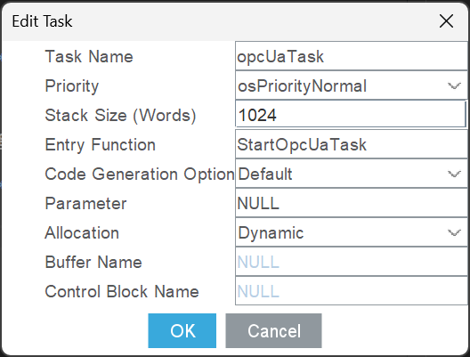

> Detailed setup of FreeRTOS can be looked up [here](https://embeddedthere.com/getting-started-with-freertos-in-stm32-example-code-included/#What_is_RTOS).

#### FreeRTOS test

Test your FreeRTOS set up.

1. In **Task and Queues** add *Task* with **Task Name** *blinkTask*, **Entry Function** to *StartBlinkTask* , **Priority** set to *osPriorityNormal*.

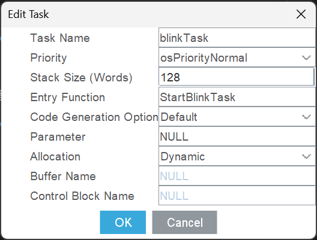

2. Generate code **Project > Generate Code**.

3. In **main.c** in **opcUaTask** task add the following code:

```C
void StartOpcUaTask(void const * argument)
{
  /* USER CODE BEGIN 5 */
  /* Infinite loop */
  for(;;)
  {
	  HAL_GPIO_TogglePin(GPIOB, GPIO_PIN_14);
	  osDelay(1000);
  }
  /* USER CODE END 5 */
}
```

4. In **main.c** in **blinkTask** task add the following code:

```C
void StartBlinkTask(void const * argument)
{
  /* USER CODE BEGIN StartBlinkTask */
  /* Infinite loop */
  for(;;)
  {
	  HAL_GPIO_TogglePin(GPIOB, GPIO_PIN_7);
	  osDelay(1000);
  }
  /* USER CODE END StartBlinkTask */
}
```

5. Upload program to board.

If on board Red and Blue LEDs simultaneously light up than FreeRTOS set up was successful.

> Each STM32 board has a debugger. Using a new board requires set up of a debugger which can be done in **Run > Run Configuration >  Debugger > ST-LINK S/N > Scan**.

### LWIP configuration

For this section you should have a functioning FreeRTOS. A thorough guide is [here](#freertos-configuration).

1. In <.ioc> file go to **Middleware and  Software Packs > LWIP** and click *Enable*.

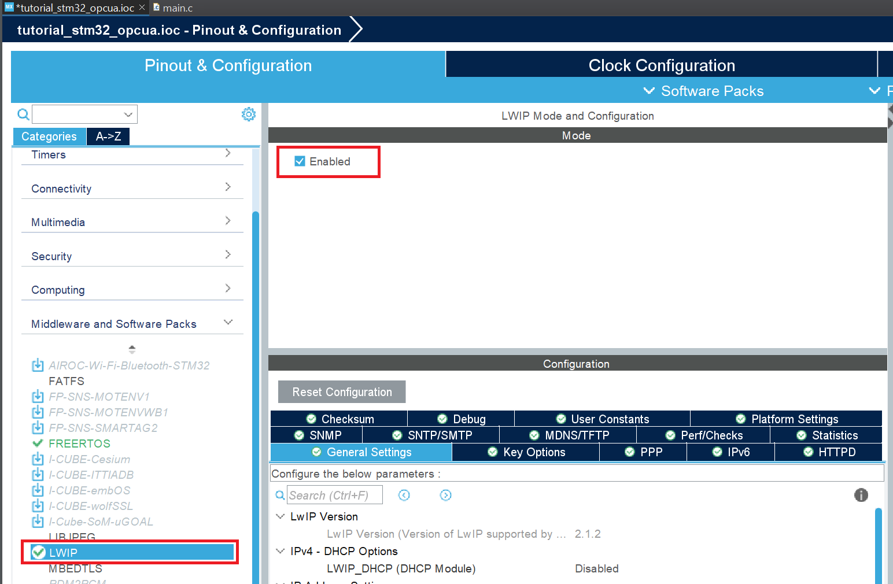

2. In **General Settings > LWIP_DHCP (DHCP Module)** to *Disabled*. Set up IP of the board, it will be client's ip.

> To avoid code regeneration in order to change ip in the future, ip can be changed in **LWIP > App > lwip.c**.
   
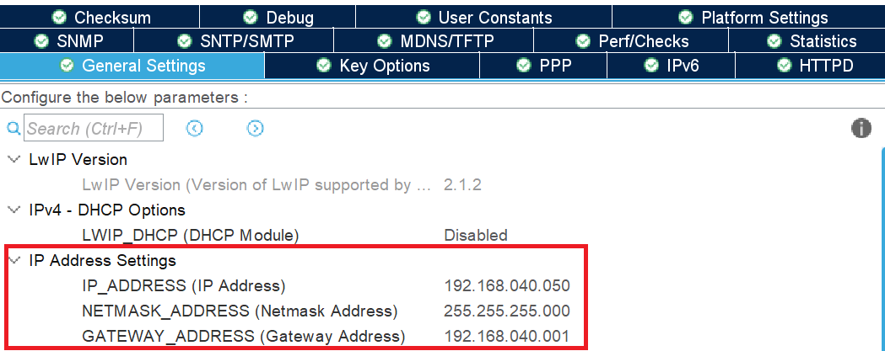

1. In **Key Options > Infrastructure - Heap and Memory Pools Options > MEM_SIZE(Heap Memory Size)** set *16\*1024 Bytes*.

> Memory required for TCP/IP connection.

4. In **Platform Settings** change to *LAN8742* in both fields.

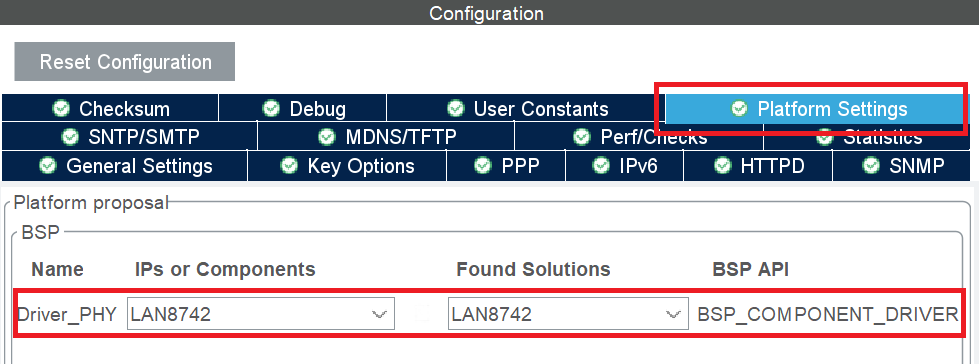

#### LWIP test

Test your LWIP on FreeRTOS system. 

1. In Windows go to **Control Panel > Network and Internet > Network and Sharing Center > Change adapter settings** right-click on your Ethernet port **Properties > Internet Protocol Version 4 (TCP/IPv4)**. Click *Use the following ip address* and set server ip address.

> Ip addresses of the PC and board must have the same subnet.

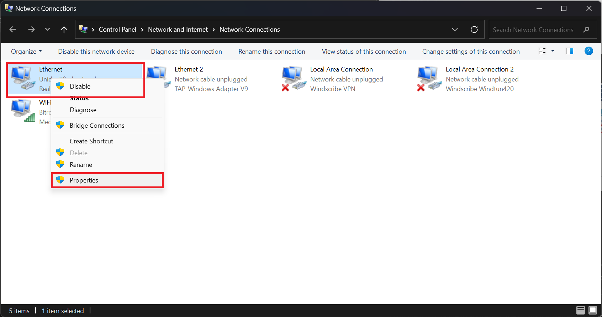

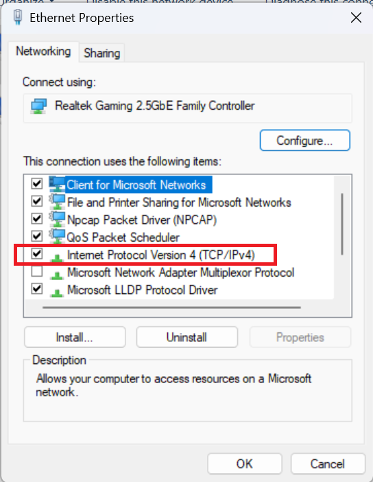

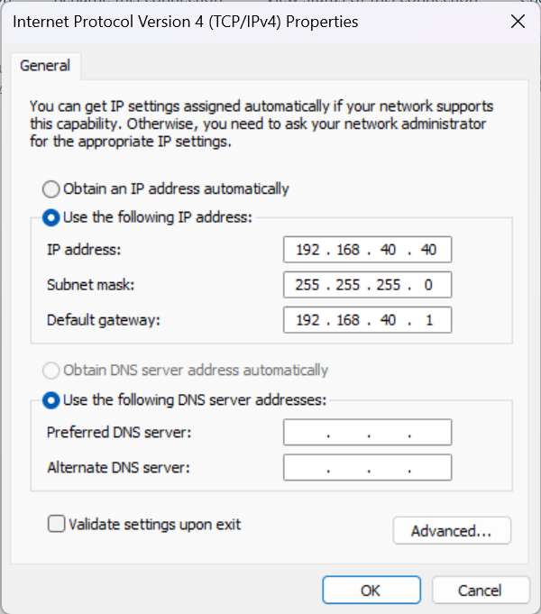

2. Connect the board to the PC via ethernet.

3. Open **Command Prompt** on the PC and "ping" your board with its ip address.

```cmd
ping 192.168.40.50
```

4. The following result is a success.

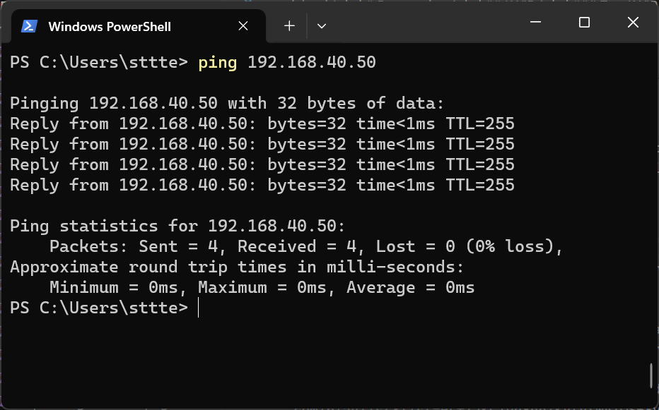

> Detailed guide on LWIP can be found [here](https://www.youtube.com/playlist?list=PLfIJKC1ud8ggZKVtytWAlOS63vifF5iJC).


### Printf configuration (optional)

Printf function can help display data into Terminal via USART.

1. In **main.c** include the following package:

```C
/* USER CODE BEGIN Includes */
#include "stdio.h"
/* USER CODE END Includes */
```

2. In **main.c** add the following code:

```C
/* USER CODE BEGIN PFP */
#define PUTCHAR_PROTOTYPE int __io_putchar(int ch)
/* USER CODE END PFP */
```

3. In **main.c** add the following code:

```C
/* USER CODE BEGIN 4 */
PUTCHAR_PROTOTYPE
{
  HAL_UART_Transmit(&huart3, (uint8_t *)&ch, 1, 0xFFFF);

  return ch;
}
/* USER CODE END 4 */
```

4. In **.ioc** go to **Connectivity > USART3** in **Mode** choose *Asynchronous*.

5. Setup GPIO according to the schematics.

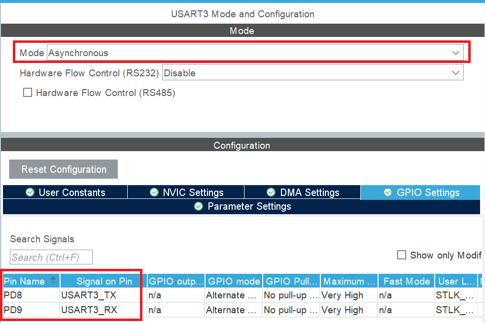

#### Printf test

1. In **main.c** in **blinkTask** function add the following code:

> Pay attention to the **\n\r** operator. Without them printf will not execute as expected.

```C
void StartBlinkTask(void const * argument)
{
    for(;;)
    {
        printf("blinkTask running.\n\r");
    }
}
```

2. Upload project to board.

3. Open **Tera Term**. Choose *Serial* with STM32 port.

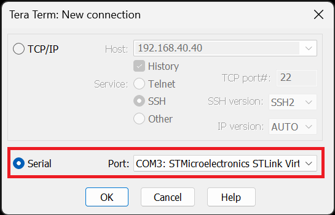

4. In **Tera Term** go to **Setup > Serial port... > Speed** set to *115200*.

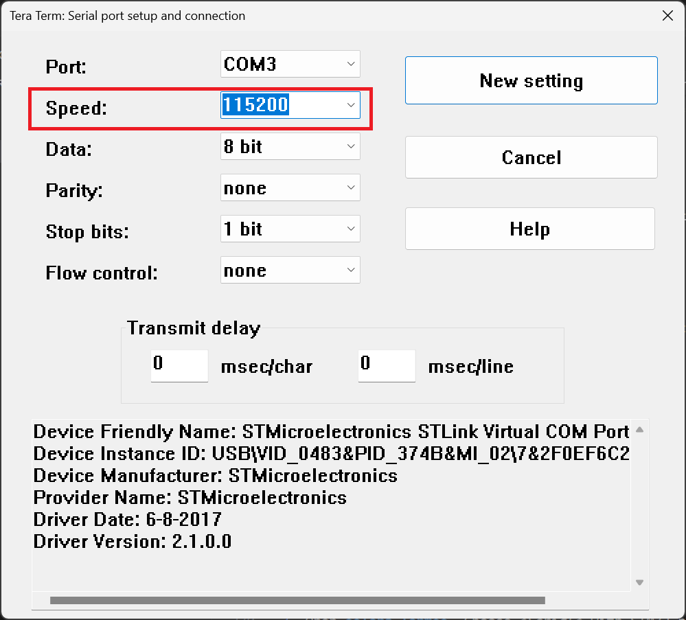

Now there should be a message display in Tera Term.

## Open62541 library integration

### Library download

1. Download latest stable version of OPC UA library open62541 from their [GitHub](https://github.com/open62541/open62541/releases). Tutorial uses version 1.3.9.
2. Extract archive and you will be left with one repository.

### Library build

1. Create a folder with name *Build* where the built library will go.
2. Open Cmake. In **Where the source code code:** insert path to the repository with open62541 library. In **Where to build the binaries:** insert path to the created *Build* repository. Finally, click *Configure* and click *Finish* in the opened window.

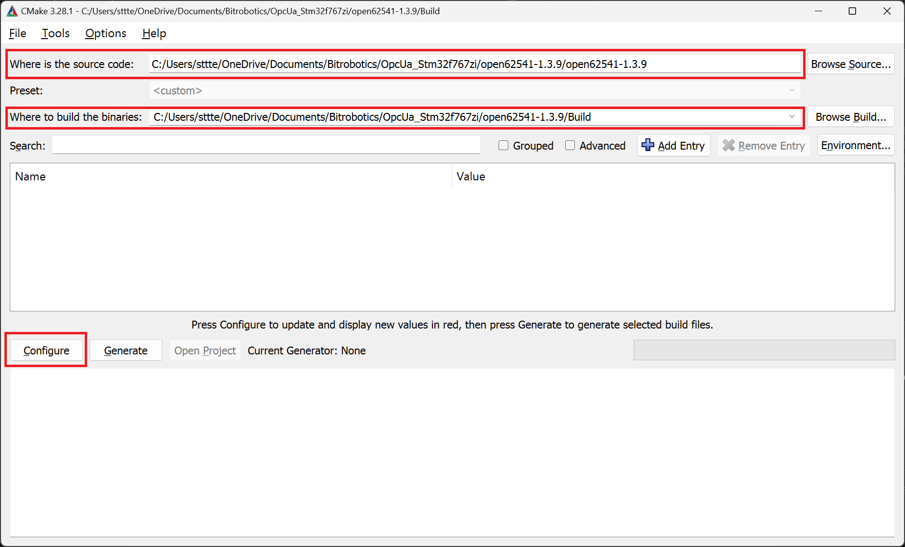

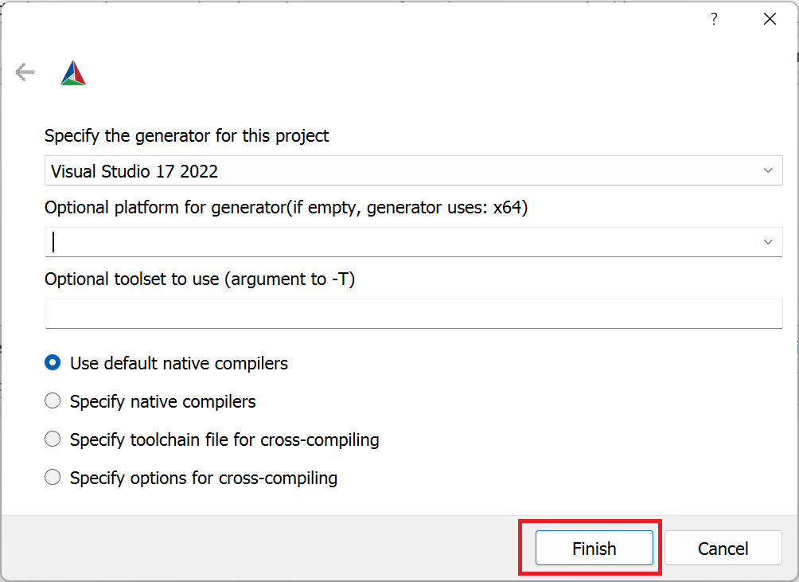

3. After configuration there should appear several option for further configuration. There are more information about build options in the [open62541 documentation](https://www.open62541.org/doc/1.3/building.htmlhttps://www.open62541.org/doc/1.3/) build section. For this tutorial these options should be configured:

UA_ARCHITECTURE=freertosLWIP

UA_ENABLE_AMALGAMATION=ON

Leave everything as it is and click *Configure*.

4. Now configure the last option:

UA_ARCH_FREERTOS_USE_OWN_MEMORY_FUNCTIONS=ON

and click *Generate*.

5. When **Generation** is complete click *Open Project*, it should display **Current Generator**: Visual Studio *your version*. Click *Open Project* this should start up Visual Studio.

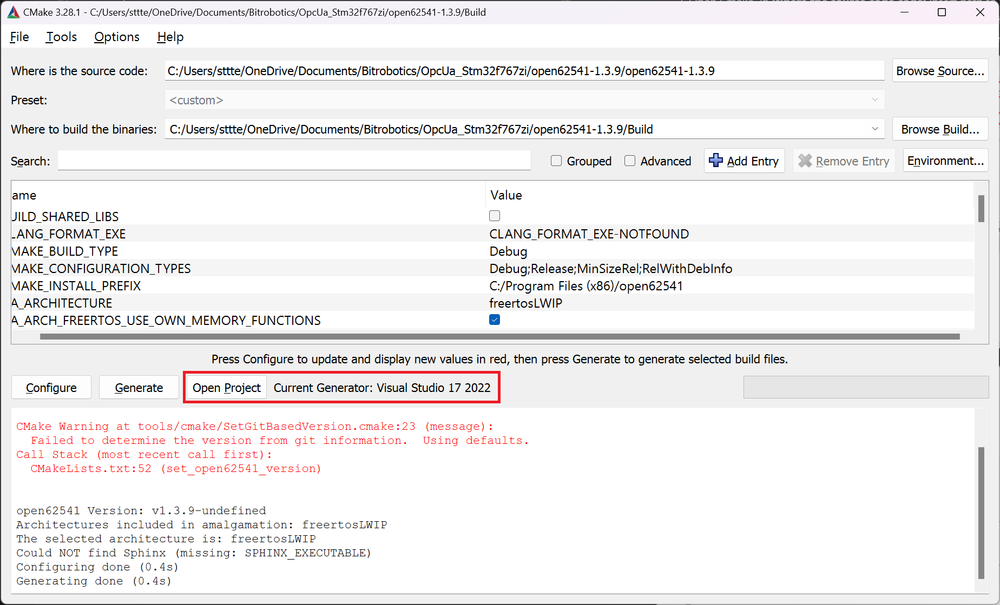

6. In Visual Studio click **Build > ALL_BUILD**. It will generate an error, however, it is fine and the build part is complete. Now build library should be in *Build* folder.

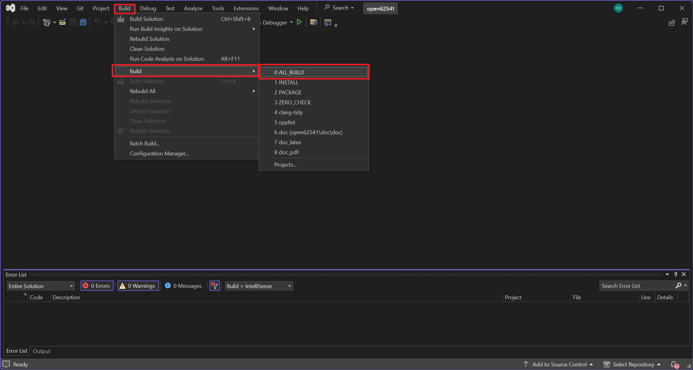

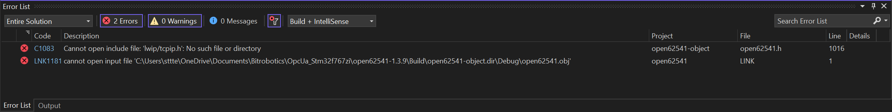

7. Import *open62541.c* and *open62541.h* files from **Build** folder into the project **Core > Src** and **Core > Inc** respectively.

### Library adjustments

1. In project go to **File > Properties > C/C++ General > Paths and Symbols > Symbols** click *Add...*. In *Name* type *UA_ARCHITECTURE_FREERTOSLWIP* and check all boxes.

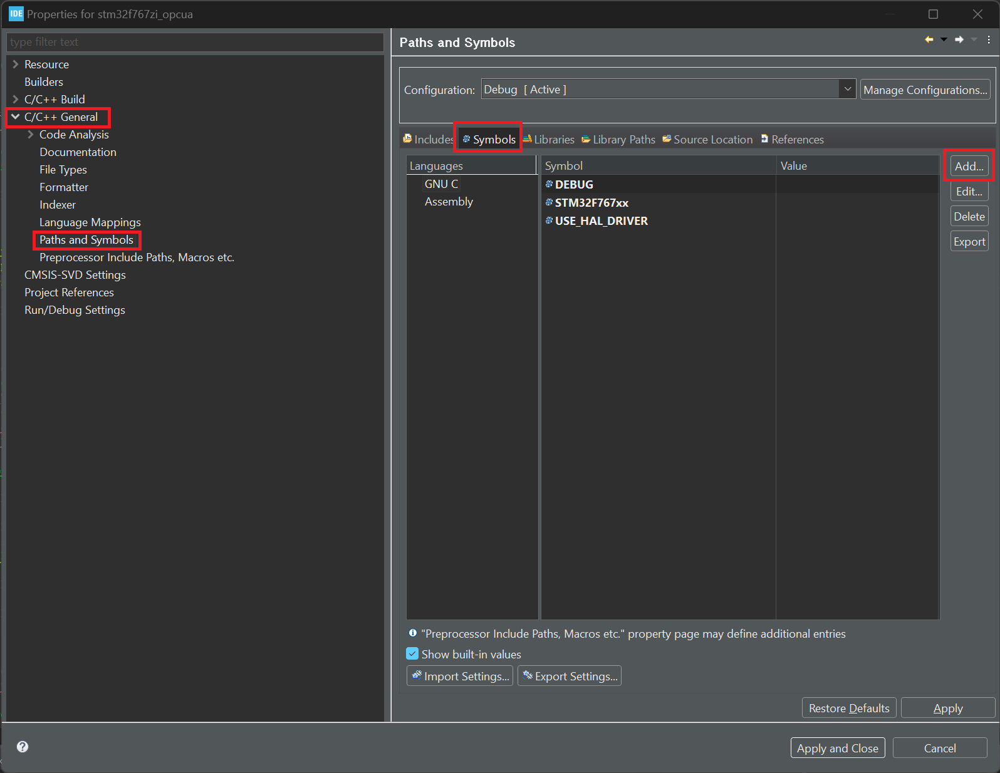

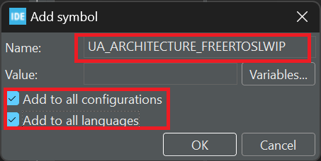

2. In **LWIP > Target > lwipopts.h** add the following definitions:

```C
/* USER CODE BEGIN 1 */
#define LWIP_COMPAT_SOCKETS 0 // Don't do name define-transformation in networking function names.
#define LWIP_SOCKET 1 // Enable Socket API (normally already set)
#define LWIP_DNS 1 // enable the lwip_getaddrinfo function, struct addrinfo and more.
#define SO_REUSE 1 // Allows to set the socket as reusable
#define LWIP_TIMEVAL_PRIVATE 0 // This is optional. Set this flag if you get a compilation error about redefinition of struct timeval
/* USER CODE END 1 */
```

3. In **Core > Inc > FreeRTOSConfig.h** add the following definitions:

```C
/* USER CODE BEGIN Defines */
/* Section where parameter definitions can be added (for instance, to override default ones in FreeRTOS.h) */
#define configCHECK_FOR_STACK_OVERFLOW 1
#define configUSE_MALLOC_FAILED_HOOK 1
/* USER CODE END Defines */
```

4. In **main.c** include open62541:

```C
/* USER CODE BEGIN Includes */
#include "open62541.h"
/* USER CODE END Includes */
```

5. In **main.c** add the following code:

```C
/* USER CODE BEGIN 4 */
void vApplicationMallocFailedHook(){
	for(;;){
		vTaskDelay(pdMS_TO_TICKS(1000));	
	}
}

void vApplicationStackOverflowHook( TaskHandle_t xTask, char *pcTaskName ){
	for(;;){
		vTaskDelay(pdMS_TO_TICKS(1000));
	}
}
/* USER CODE END 4 */
```

6. Build the project.

> In case of errors during the build consult the following resourses:
> 1. [open62541 documentation (build)](https://www.open62541.org/doc/1.3/building.html#building-the-examples);
> 2. [github discussion](https://github.com/open62541/open62541/pull/2511).

## Client configuration

1. In **main.c** in *opcUaTask* insert the following code for client:

> If you have a printf statement in separate task from printf test comment out printf line. It will conflict with opcUaTask and latter will not connect.

```C
void StartOpcUaTask(void const * argument)
{
  /* init code for LWIP */
  MX_LWIP_Init();
  /* USER CODE BEGIN 5 */
  UA_Client *client = UA_Client_new();
      UA_ClientConfig_setDefault(UA_Client_getConfig(client));
      UA_StatusCode retval = UA_Client_connect(client, "opc.tcp://192.168.40.40:4840");
      if(retval != UA_STATUSCODE_GOOD) {
          UA_Client_delete(client);

      }

      UA_Variant_init(&value);
      const UA_NodeId nodeId = UA_NODEID_NUMERIC(0, UA_NS0ID_SERVER_SERVERSTATUS_CURRENTTIME);

  /* Infinite loop */
  for(;;)
  {
      retval = UA_Client_readValueAttribute(client, nodeId, &value);
	  if(retval == UA_STATUSCODE_GOOD && UA_Variant_hasScalarType(&value, &UA_TYPES[UA_TYPES_DATETIME])) {
	            UA_DateTime raw_date = *(UA_DateTime *) value.data;
	            UA_DateTimeStruct dts = UA_DateTime_toStruct(raw_date);
	            UA_LOG_INFO(UA_Log_Stdout, UA_LOGCATEGORY_USERLAND, "date is: %u-%u-%u %u:%u:%u.%03u\n\r",
	                        dts.day, dts.month, dts.year, dts.hour, dts.min, dts.sec, dts.milliSec);}
  }
  /* USER CODE END 5 */
}
```

2. Build your code and upload.

> Client example is taken from [here](https://www.open62541.org/doc/1.3/tutorial_client_firststeps.html).

3. Start up your server.

> Mind the ip addresses of server, client and your PC.

4. Open Tera Term. 

Connection status should be seen in Tera Term.